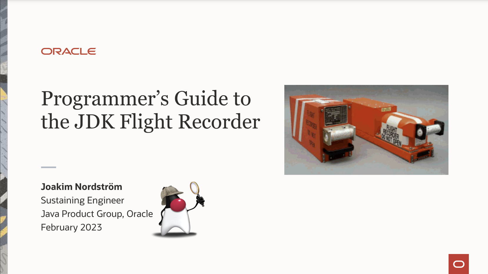

Before we start investigate some performance problems using Jeffrey, we need to generate a recording of our Java
application.
JFR recording file contains emitted events that were registered and enabled in the configuration.
[https://docs.oracle.com/en/java/javase/22/jfapi/manually-register-and-unregister-event.html](https://docs.oracle.com/en/java/javase/22/jfapi/manually-register-and-unregister-event.html).

In this article, we're going to discuss the options to generate the JFR recording and its advantages and disadvantages.
If you want to know
more details about JFR file itself, please have a look at [Mandatory Literature](/posts/001-literature) blog post.

> This article contains my personal recommendations, someone else can have different preferences

In general, there are two main options to generate JFR file:

- using [JDK Flight Recorder](https://docs.oracle.com/en/java/java-components/jdk-mission-control/8/user-guide/using-jdk-flight-recorder.html)
- using [Async-Profiler](https://github.com/async-profiler/async-profiler)

> Never forget to enable DebugNonSafepoints, it should be a
> default: [https://jpbempel.github.io/2022/06/22/debug-non-safepoints.html](https://jpbempel.github.io/2022/06/22/debug-non-safepoints.html)

## Using JDK Flight Recorder

JDK Flight Recorder is the official way to enable emitting JFR events and generating JFR recordings. It's a part of the
OpenJDK and should be
available in every reasonable build.

By default, OpenJDK contains 2 configuration files for JFR: _default_ and _profile_ ($JAVA_HOME/lib/jfr).
_Profile_ has much lower thresholds (the threshold when to emit the event) and almost all event types enabled.
In general, the more events, the higher overhead. However, not significantly higher than 2%.

Great source of information is on Azul pages: [https://docs.azul.com/prime/Java-Flight-Recorder](https://docs.azul.com/prime/Java-Flight-Recorder)
- JVM Zing contains some additional events regarding Time-To-Safepoints 
- explanation of the most interesting JFR configuration parameters: [https://docs.azul.com/prime/Java-Flight-Recorder#jfr-options](https://docs.azul.com/prime/Java-Flight-Recorder#jfr-options) 

#### Advantages of JFR

- build-in support, no additional libraries needed
- well-suited configuration _default_ (for continuous profiling) and _profile_ (for ad-hoc intensive profiling)
- lot of options to tune the recording using JCMD
  command (https://github.com/openjdk/jdk/blob/master/src/jdk.jfr/share/classes/jdk/jfr/internal/dcmd/DCmdStart.java#L348)
- compatibility with streaming features:
    - directly streaming events inside the JVM process [https://hirt.se/blog/?p=1239](https://hirt.se/blog/?p=1239)
    - streaming events using different processes on the same host from an event repository (a directory where JFR
      buffers are flushed to)
    - remote streaming via JMX from remote
      hosts [https://egahlin.github.io/2021/05/17/remote-recording-stream.html](https://egahlin.github.io/2021/05/17/remote-recording-stream.html)
- lot of effort to keep the overhead under the control - [Event Throttling](https://github.com/openjdk/jdk/blob/jdk-17+19/src/hotspot/share/jfr/recorder/service/jfrEventThrottler.hpp) (currently only for _jdk.ObjectAllocationSample_)

#### Disadvantages of JFR

- ExecutionSamples ("CPU-profile") 
  - is not CPU profiling at all - [jfrThreadSampler.cpp: Sampling Algorithm](https://github.com/openjdk/jdk/blob/master/src/hotspot/share/jfr/periodic/sampling/jfrThreadSampler.cpp#L586)
  - it just periodically iterates through all Java threads in "Runnable" state - [jfrThreadSampler.cpp: Thread State Resolving](https://github.com/openjdk/jdk/blob/master/src/hotspot/share/jfr/periodic/sampling/jfrThreadSampler.cpp#L57) 
  - it's not triggered by the time on CPU
  - samples only Java threads, not JVM (JIT, GC, ...), nor threads in JVMTI Agents
  - does not contain C++ frames, kernel frames

<div class="gallery-box">
  <div class="gallery">
    
  </div>
<em>Author: <a href="https://x.com/AndreiPangin" style="color: blue">Andrei Pangin</a></em>
</div>

### JFR Configuration Options

```
$ jcmd <pid> help JFR.start

(part of the output omitted)

JFR.start [options]

Options:

  delay           (Optional) Length of time to wait before starting to record
                  (INTEGER followed by 's' for seconds 'm' for minutes or h' for
                  hours, 0s)

  disk            (Optional) Flag for also writing the data to disk while recording
                  (BOOLEAN, true)

  dumponexit      (Optional) Flag for writing the recording to disk when the Java
                  Virtual Machine (JVM) shuts down. If set to 'true' and no value
                  is given for filename, the recording is written to a file in the
                  directory where the process was started. The file name is a
                  system-generated name that contains the process ID, the recording
                  ID and the current time stamp. (For example:
                  id-1-2021_09_14_09_00.jfr) (BOOLEAN, false)

  duration        (Optional) Length of time to record. Note that 0s means forever
                  (INTEGER followed by 's' for seconds 'm' for minutes or 'h' for
                  hours, 0s)

  filename        (Optional) Name of the file to which the flight recording data is
                  written when the recording is stopped. If no filename is given, a
                  filename is generated from the PID and the current date and is
                  placed in the directory where the process was started. The
                  filename may also be a directory in which case, the filename is
                  generated from the PID and the current date in the specified
                  directory. (STRING, no default value)

                  Note: If a filename is given, '%p' in the filename will be
                  replaced by the PID, and '%t' will be replaced by the time in
                  'yyyy_MM_dd_HH_mm_ss' format.

  maxage          (Optional) Maximum time to keep the recorded data on disk. This
                  parameter is valid only when the disk parameter is set to true.
                  Note 0s means forever. (INTEGER followed by 's' for seconds 'm'
                  for minutes or 'h' for hours, 0s)

  maxsize         (Optional) Maximum size of the data to keep on disk in bytes if
                  one of the following suffixes is not used: 'm' or 'M' for
                  megabytes OR 'g' or 'G' for gigabytes. This parameter is valid
                  only when the disk parameter is set to 'true'. The value must not
                  be less than the value for the maxchunksize parameter set with
                  the JFR.configure command. (STRING, 0 (no max size))

  name            (Optional) Name of the recording. If no name is provided, a name
                  is generated. Make note of the generated name that is shown in
                  the response to the command so that you can use it with other
                  commands. (STRING, system-generated default name)

  path-to-gc-root (Optional) Flag for saving the path to garbage collection (GC)
                  roots at the end of a recording. The path information is useful
                  for finding memory leaks but collecting it is time consuming.
                  Turn on this flag only when you have an application that you
                  suspect has a memory leak. If the settings parameter is set to
                  'profile', then the information collected includes the stack
                  trace from where the potential leaking object was allocated.
                  (BOOLEAN, false)

  settings        (Optional) Name of the settings file that identifies which events
                  to record. To specify more than one file, use the settings
                  parameter repeatedly. Include the path if the file is not in
                  JAVA-HOME/lib/jfr. The following profiles are included with the
                  JDK in the JAVA-HOME/lib/jfr directory: 'default.jfc': collects a
                  predefined set of information with low overhead, so it has minimal
                  impact on performance and can be used with recordings that run
                  continuously; 'profile.jfc': Provides more data than the
                  'default.jfc' profile, but with more overhead and impact on
                  performance. Use this configuration for short periods of time
                  when more information is needed. Use none to start a recording
                  without a predefined configuration file. (STRING,
                  JAVA-HOME/lib/jfr/default.jfc)

Event settings and .jfc options can also be specified using the following syntax:

  jfc-option=value    (Optional) The option value to modify. To see available
                      options for a .jfc file, use the 'jfr configure' command.

  event-setting=value (Optional) The event setting value to modify. Use the form:
                      <event-name>#<setting-name>=<value>
                      To add a new event setting, prefix the event name with '+'.
```

```      
$ jcmd <pid> help JFR.configure

(part of the output omitted)
        
JFR.configure

Options:

  globalbuffercount   (Optional) Number of global buffers. This option is a legacy
                      option: change the memorysize parameter to alter the number of
                      global buffers. This value cannot be changed once JFR has been
                      initialized. (STRING, default determined by the value for
                      memorysize)

  globalbuffersize    (Optional) Size of the global buffers, in bytes. This option is a
                      legacy option: change the memorysize parameter to alter the size
                      of the global buffers. This value cannot be changed once JFR has
                      been initialized. (STRING, default determined by the value for
                      memorysize)

  maxchunksize        (Optional) Maximum size of an individual data chunk in bytes if
                      one of the following suffixes is not used: 'm' or 'M' for
                      megabytes OR 'g' or 'G' for gigabytes. This value cannot be
                      changed once JFR has been initialized. (STRING, 12M)

  memorysize          (Optional) Overall memory size, in bytes if one of the following
                      suffixes is not used: 'm' or 'M' for megabytes OR 'g' or 'G' for
                      gigabytes. This value cannot be changed once JFR has been
                      initialized. (STRING, 10M)

  repositorypath      (Optional) Path to the location where recordings are stored until
                      they are written to a permanent file. (STRING, The default
                      location is the temporary directory for the operating system. On
                      Linux operating systems, the temporary directory is /tmp. On
                      Windows, the temporary directory is specified by the TMP
                      environment variable)

  dumppath            (Optional) Path to the location where a recording file is written
                      in case the VM runs into a critical error, such as a system
                      crash. (STRING, The default location is the current directory)

  stackdepth          (Optional) Stack depth for stack traces. Setting this value
                      greater than the default of 64 may cause a performance
                      degradation. This value cannot be changed once JFR has been
                      initialized. (LONG, 64)

  thread_buffer_size  (Optional) Local buffer size for each thread in bytes if one of
                      the following suffixes is not used: 'k' or 'K' for kilobytes or
                      'm' or 'M' for megabytes. Overriding this parameter could reduce
                      performance and is not recommended. This value cannot be changed
                      once JFR has been initialized. (STRING, 8k)

  preserve-repository (Optional) Preserve files stored in the disk repository after the
                      Java Virtual Machine has exited. (BOOLEAN, false)
```

- <b>flush-interval</b> not available in the help [https://github.com/openjdk/jdk/blob/master/src/jdk.jfr/share/classes/jdk/jfr/internal/dcmd/DCmdStart.java#L511](https://github.com/openjdk/jdk/blob/master/src/jdk.jfr/share/classes/jdk/jfr/internal/dcmd/DCmdStart.java#L511) 



- [PDF Joakim Nordström - Programmer’s Guide to the JDK Flight Recorder](../Programmers-Guide-to-JDK-Flight-Recorder.pdf)

### Async-Profiler Configuration Options

- Async-profiler automatically enables 
 
#### Only CPU events (with C++ and Kernel stacks), 30 sec, JFR output

- counting of CPU samples: https://github.com/async-profiler/async-profiler/discussions/466
- _perf_events_ requires for non-root access this configuration

```
$ sysctl kernel.perf_event_paranoid=1
$ sysctl kernel.kptr_restrict=0
```

```
$ java -agentpath:/path/to/libasyncProfiler.so=start,timeout=30s,event=cpu,file=profile.jfr
```

#### CPU + Alloc, 30 sec, JFR output

```
$ java -agentpath:/path/to/libasyncProfiler.so=start,timeout=30s,event=cpu,alloc,file=profile.jfr
```

#### CPU + Alloc + Locks,  30 sec, JFR output

```
$ java -agentpath:/path/to/libasyncProfiler.so=start,timeout=30s,event=cpu,alloc,lock,file=profile.jfr
```

#### CPU + all-events-from-profile, 30 sec, JFR output

- merges Async-Profiler events with events from JFR (default/profile)

```
$ java -agentpath:/path/to/libasyncProfiler.so=start,timeout=30s,event=cpu,jfrSync=profile,file=profile.jfr
```

#### ctimer as a CPU mode inside a container

- does not contain kernel frames 

```
LD_PRELOAD=/path/to/libasyncProfiler.so
ASPROF_COMMAND=start, event=cpu, file=profile.jfr 
NativeApp
```
