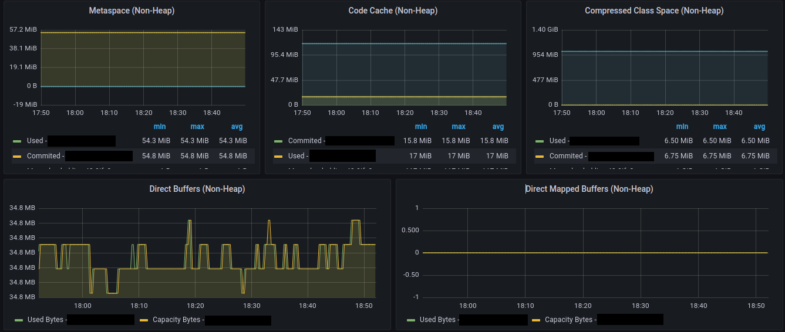

# What takes memory inside a JVM Process

The JVM process contains several parts where the memory can be consumed. It even contains
multiple custom allocators that take care of some allocated chunk of memory and these
allocators are dedicated to one specific reason in the JVM Process. Let's write them down
and briefly talk about them.

JVM is a pretty complicated piece of software, and it's sometimes very hard to predict its
behavior because of a lot of ergonomics inside - in other words, some parts "lives its own life".
That means that the decisions about allocating memory is very often based not only on workload, 
but it's affected by available memory on the host, defaults or provided options.

This short article is mainly focused on discovering of the allocated memory, more than how
the JVM Options or Garbage Collector works. Let's start with some basics, and we will probably 
go deeper in some upcoming articles :).

In general, the memory in process handled by JVM is divided into:

### Java Heap
- a space where you application allocates the objects
- the objects can be allocated even by JNI (a library written in C/C++ and called from the app)
- however, it also contains non-application allocations caused by JVM internal stuff 
such as Stacks of [VirtualThreads](https://openjdk.org/jeps/425)

### Native Memory (Off-Heap)
- in general, everything what is outside the Heap is called as a native allocation
- the native application can be triggered by `malloc`, and then the memory is placed a managed 
by the C-Heap, very likely using some arenas where a chunk of memory is allocated and when the 
chunk is freed, then it can be reused for another allocation (the behavior can differ depending on
the implementation of `malloc` allocator - default 
[GNU Allocator](https://www.gnu.org/software/libc/manual/html_node/The-GNU-Allocator.html), 
alternative - [jemalloc](http://jemalloc.net/))
- or mapping a bigger chunk of memory using [mmap](https://man7.org/linux/man-pages/man2/mmap.2.html)
- JVM in some cases maps a bigger part of Virtual memory and implements its own specialized allocator, 
e.g. [Metaspace](https://blogs.sap.com/2021/07/16/jep-387-elastic-metaspace-a-new-classroom-for-the-java-virtual-machine/?s=03)

There are other ways to allocate the off-heap memory directly from Java code:

#### Using Unsafe
- this is definitely not recommended way of handling off-heap allocation, and it will be forbidden by the module system in Java
- it was very often used by third-party libraries to allocate a chunk of memory and implement their own specialized allocator, 
e.g. Off-heap allocator in Netty (if I am not mistaken) to avoid garbage collections

```java
Field f = Unsafe.class.getDeclaredField("theUnsafe");
f.setAccessible(true);
Unsafe unsafe = (Unsafe) f.get(null);

// Allocates 50MB of native memory
int memoryBlock = 50 * 1024 * 1024;
long address = unsafe.allocateMemory(memoryBlock);
```

Native Memory Tracking output:

```text
Total: reserved=6755091KB +51201KB, committed=477635KB +51201KB
...
-                     Other (reserved=51210KB +51200KB, committed=51210KB +51200KB)
                            (malloc=51210KB +51200KB #3 +1)
```

#### Direct Buffers
- a current official way to handle a chunk of the off-heap memory
- it's automatically discarded and the allocated memory released based on the (Cleaner)[https://docs.oracle.com/en/java/javase/19/docs/api/java.base/java/lang/ref/Cleaner.html]
- the dependence on **Cleaner** can be also the weakness of this Off-heap approach because it's based on Phantom-reference, and it can delay
de-allocation of the memory chunk until the GC starts Reference Processing phase (varies from one GC algorithm to another)

```java
// Allocates 50MB of native memory
int memoryBlock = 50 * 1024 * 1024;
ByteBuffer directBuf = ByteBuffer.allocateDirect(memoryBlock);
```

```text
Total: reserved=6749056KB +51202KB, committed=465708KB +51202KB
...
-                     Other (reserved=51210KB +51200KB, committed=51210KB +51200KB)
                            (malloc=51210KB +51200KB #3 +1)
```

#### Foreign Function & Memory API
- [Foreign Function & Memory API](https://openjdk.org/jeps/424) is a part of the [Panama Project](https://openjdk.org/projects/panama/)
- it's intended to be a replacement for `Unsafe` approach providing good performance and security guarantees, creating a memory layout 
with "structs" and avoiding manual counting of addresses

## What part eats up my memory!

Very often, developers watch out for the part which is dedicated to Heap memory. It's very likely 
the biggest part but also the other parts can take up some significant portion. Especially 
in Container Environment, we can end up in some situations where the consumed native memory differs
a lot depending on the activated GC algorithm, or a number of classes load by JVM (Metaspace) and 
optimized later by JIT Compiler (CodeCache). Let's go deeper into JVM Memory and Containers in 
a specialized article because the topic is huge (and very interesting)!

JVM offers a simple way to look into memory internals. The functionality is called 
[Native Memory Tracking](https://docs.oracle.com/en/java/javase/19/troubleshoot/troubleshooting-memory-leaks.html#GUID-79F26B47-9240-4F32-A817-1DD77A361F31).
There are two modes, if you are not a developer of OpenJDK, you will be OK with the `summary` mode.
We need to enable it before we start the app using a special option:

```
-XX:NativeMemoryTracking=summary
```

then we are free to call JCMD console to get the statistics

```shell
$ jcmd <pid> VM.native_memory
```

and we get something like this:

```text
$ jcmd <pid> VM.native_memory summary                                                                
Native Memory Tracking:

(Omitting categories weighting less than 1KB)

Total: reserved=6703878KB, committed=426422KB
       malloc: 22530KB #64479
       mmap:   reserved=6681348KB, committed=403892KB

-                 Java Heap (reserved=5062656KB, committed=327680KB)
                            (mmap: reserved=5062656KB, committed=327680KB) 
 
-                     Class (reserved=1048824KB, committed=1464KB)
                            (classes #2683)
                            (  instance classes #2412, array classes #271)
                            (malloc=248KB #4423) 
                            (mmap: reserved=1048576KB, committed=1216KB) 
                            (  Metadata:   )
                            (    reserved=65536KB, committed=8640KB)
                            (    used=8510KB)
                            (    waste=130KB =1,50%)
                            (  Class space:)
                            (    reserved=1048576KB, committed=1216KB)
                            (    used=1092KB)
                            (    waste=124KB =10,19%)
 
-                    Thread (reserved=19556KB, committed=968KB)
                            (thread #19)
                            (stack: reserved=19504KB, committed=916KB)
                            (malloc=31KB #118) 
                            (arena=20KB #36)
 
-                      Code (reserved=247963KB, committed=7823KB)
                            (malloc=275KB #2077) 
                            (mmap: reserved=247688KB, committed=7548KB) 
 
-                        GC (reserved=238187KB, committed=62475KB)
                            (malloc=17227KB #1190) 
                            (mmap: reserved=220960KB, committed=45248KB) 
 
-                 GCCardSet (reserved=18KB, committed=18KB)
                            (malloc=18KB #243) 
 
-                  Compiler (reserved=188KB, committed=188KB)
                            (malloc=23KB #120) 
                            (arena=165KB #5)
 
-                  Internal (reserved=219KB, committed=219KB)
                            (malloc=183KB #2563) 
                            (mmap: reserved=36KB, committed=36KB) 
 
-                     Other (reserved=10KB, committed=10KB)
                            (malloc=10KB #2) 
 
-                    Symbol (reserved=2861KB, committed=2861KB)
                            (malloc=2501KB #51738) 
                            (arena=360KB #1)
 
-    Native Memory Tracking (reserved=1013KB, committed=1013KB)
                            (malloc=5KB #77) 
                            (tracking overhead=1008KB)
 
-        Shared class space (reserved=16384KB, committed=12600KB)
                            (mmap: reserved=16384KB, committed=12600KB) 
 
-               Arena Chunk (reserved=195KB, committed=195KB)
                            (malloc=195KB) 
 
-                    Module (reserved=157KB, committed=157KB)
                            (malloc=157KB #1221) 
 
-                 Safepoint (reserved=8KB, committed=8KB)
                            (mmap: reserved=8KB, committed=8KB) 
 
-           Synchronization (reserved=48KB, committed=48KB)
                            (malloc=48KB #601) 
 
-            Serviceability (reserved=17KB, committed=17KB)
                            (malloc=17KB #9) 
 
-                 Metaspace (reserved=65575KB, committed=8679KB)
                            (malloc=39KB #15) 
                            (mmap: reserved=65536KB, committed=8640KB) 
 
-      String Deduplication (reserved=1KB, committed=1KB)
                            (malloc=1KB #8)
```

Aleksey Shipilëv did a great job to describe the particular parts in his 
[article](https://shipilev.net/jvm/anatomy-quarks/12-native-memory-tracking/).

## More popular digging into JVM memory allocations

Sometimes you don't want to manipulate with JVM options (or you don't have any way to set up the option),
but still you would like to se if it's everything kinda OK. In this chapter, we'll focus on getting the 
information directly from Java, and using Springboot framework and implementing some graphs.

The most used way to get some information is using `Platform MXBeans` (this is also the way used by the 
majority of frameworks, those I have checked at least). We can also use `BufferPoolMXBean` to get the 
information about `java.nio.ByteBuffer.allocateDirect` and `java.nio.MappedByteBuffer`.

```java
public class Memory {

    public static void main(String[] args) {
        ManagementFactory.getMemoryPoolMXBeans()
                .forEach(memoryPool -> printMemoryUsage(memoryPool.getUsage(), memoryPool.getName()));
    }

    private static void printMemoryUsage(MemoryUsage memory, String memoryName) {
        String line = "INIT: %s, USED: %s, COMMITTED: %s, MAX: %s".formatted(
                toMB(memory.getInit()),
                toMB(memory.getUsed()),
                toMB(memory.getCommitted()),
                toMB(memory.getMax()));

        out.println(memoryName);
        out.println(line);
        out.println();
    }

    private static String toMB(long bytes) {
        return (bytes >> 20) + " MB";
    }
}
```

The output shows at least the most significant memory pools used by our application:

- `CodeHeap 'non-nmethods'`, `CodeHeap 'non-profiled nmethods'`, `CodeHeap 'profiled nmethods'` pools that belong
to [Segmented Code Cache](https://openjdk.org/jeps/197)
(area used by JIT Compiler - generated native methods, interpreter, stubs, or the space used to keep the collected profile
later used by JIT to decide whether to compile method or not). If the JVM runs out of memory in `CodeCache`, then
we can end up with stopping JIT Compiler to produce more compiled methods and keep them being interpreted.
- [Metaspace](https://blogs.sap.com/2021/07/16/jep-387-elastic-metaspace-a-new-classroom-for-the-java-virtual-machine) 
as a place to keep classes, itable, vtable, constant pool, methods metadata, annotations, bytecode in general
- [Compressed Class Space](https://stuefe.de/posts/metaspace/what-is-compressed-class-space/) 
using 32bit references even on a 64bit platform
- Pools dedicated to `G1 Garbage Collector`

```text
CodeHeap 'non-nmethods'
INIT: 2 MB, USED: 1 MB, COMMITTED: 2 MB, MAX: 5 MB

CodeHeap 'non-profiled nmethods'
INIT: 2 MB, USED: 0 MB, COMMITTED: 2 MB, MAX: 117 MB

CodeHeap 'profiled nmethods'
INIT: 2 MB, USED: 0 MB, COMMITTED: 2 MB, MAX: 117 MB

Metaspace
INIT: 0 MB, USED: 1 MB, COMMITTED: 1 MB, MAX: -1 MB

Compressed Class Space
INIT: 0 MB, USED: 0 MB, COMMITTED: 0 MB, MAX: 1024 MB

G1 Eden Space
INIT: 24 MB, USED: 4 MB, COMMITTED: 24 MB, MAX: -1 MB

G1 Old Gen
INIT: 288 MB, USED: 3 MB, COMMITTED: 296 MB, MAX: 4944 MB

G1 Survivor Space
INIT: 0 MB, USED: 0 MB, COMMITTED: 0 MB, MAX: -1 MB
```

## JVM memory pools monitoring in practice

It's time to wrap up all the previous chapters and show how the memory pools can be monitored
in one of the very popular framework - [Spring Boot](https://spring.io/projects/spring-boot).

I have experience with combination _Spring Boot_ | _Micrometer_ | _Prometheus_ | _Grafana_. According to my opinion,
Prometheus is not the optimal way for monitoring (because of scraping where is no specific timestamp to a given "event"), 
but it's good complementary feature if the primary usage of Prometheus is alerting.

Micrometer support for collecting information about JVM Memory Pools is of course based on the `Platform MXBeans`, as we mentioned 
in the previous chapter. Have a look at the class [io.micrometer.core.instrument.binder.jvm.JvmMemoryMetrics](https://github.com/micrometer-metrics/micrometer/blob/main/micrometer-core/src/main/java/io/micrometer/core/instrument/binder/jvm/JvmMemoryMetrics.java)
to see the concrete implementation. Micrometer also registers `BufferPoolMXBean` to see usage of _DirectBuffers_ and _MappedBuffers_.

If we start the application and go to the endpoint exposing metrics `/actuator/prometheus`, then we can get something like that.

_(the executed app had SerialGC, therefore, we have a slightly different names of memory pools from G1GC)_
```text
# HELP jvm_memory_used_bytes The amount of used memory
# TYPE jvm_memory_used_bytes gauge
jvm_memory_used_bytes{area="heap",id="Tenured Gen",} 3.4405656E7
jvm_memory_used_bytes{area="nonheap",id="CodeHeap 'profiled nmethods'",} 1.9464576E7
jvm_memory_used_bytes{area="heap",id="Eden Space",} 1.20644032E8
jvm_memory_used_bytes{area="nonheap",id="Metaspace",} 7.3233248E7
jvm_memory_used_bytes{area="nonheap",id="CodeHeap 'non-nmethods'",} 1446272.0
jvm_memory_used_bytes{area="heap",id="Survivor Space",} 2290872.0
jvm_memory_used_bytes{area="nonheap",id="Compressed Class Space",} 9172008.0
jvm_memory_used_bytes{area="nonheap",id="CodeHeap 'non-profiled nmethods'",} 1.629888E7
# HELP jvm_buffer_memory_used_bytes An estimate of the memory that the Java virtual machine is using for this buffer pool
# TYPE jvm_buffer_memory_used_bytes gauge
jvm_buffer_memory_used_bytes{id="mapped - 'non-volatile memory'",} 0.0
jvm_buffer_memory_used_bytes{id="mapped",} 0.0
jvm_buffer_memory_used_bytes{id="direct",} 3.3759519E7
# HELP jvm_buffer_count_buffers An estimate of the number of buffers in the pool
# TYPE jvm_buffer_count_buffers gauge
jvm_buffer_count_buffers{id="mapped - 'non-volatile memory'",} 0.0
jvm_buffer_count_buffers{id="mapped",} 0.0
jvm_buffer_count_buffers{id="direct",} 20.0
# HELP jvm_memory_max_bytes The maximum amount of memory in bytes that can be used for memory management
# TYPE jvm_memory_max_bytes gauge
jvm_memory_max_bytes{area="heap",id="Tenured Gen",} 1.572864E8
jvm_memory_max_bytes{area="nonheap",id="CodeHeap 'profiled nmethods'",} 1.22912768E8
jvm_memory_max_bytes{area="heap",id="Eden Space",} 1.6777216E8
jvm_memory_max_bytes{area="nonheap",id="Metaspace",} -1.0
jvm_memory_max_bytes{area="nonheap",id="CodeHeap 'non-nmethods'",} 5828608.0
jvm_memory_max_bytes{area="heap",id="Survivor Space",} 2.097152E7
jvm_memory_max_bytes{area="nonheap",id="Compressed Class Space",} 1.073741824E9
jvm_memory_max_bytes{area="nonheap",id="CodeHeap 'non-profiled nmethods'",} 1.22916864E8
# HELP jvm_buffer_total_capacity_bytes An estimate of the total capacity of the buffers in this pool
# TYPE jvm_buffer_total_capacity_bytes gauge
jvm_buffer_total_capacity_bytes{id="mapped - 'non-volatile memory'",} 0.0
jvm_buffer_total_capacity_bytes{id="mapped",} 0.0
jvm_buffer_total_capacity_bytes{id="direct",} 3.3759518E7
# HELP jvm_memory_committed_bytes The amount of memory in bytes that is committed for the Java virtual machine to use
# TYPE jvm_memory_committed_bytes gauge
jvm_memory_committed_bytes{area="heap",id="Tenured Gen",} 1.572864E8
jvm_memory_committed_bytes{area="nonheap",id="CodeHeap 'profiled nmethods'",} 2.3068672E7
jvm_memory_committed_bytes{area="heap",id="Eden Space",} 1.6777216E8
jvm_memory_committed_bytes{area="nonheap",id="Metaspace",} 7.3859072E7
jvm_memory_committed_bytes{area="nonheap",id="CodeHeap 'non-nmethods'",} 2555904.0
jvm_memory_committed_bytes{area="heap",id="Survivor Space",} 2.097152E7
jvm_memory_committed_bytes{area="nonheap",id="Compressed Class Space",} 9502720.0
jvm_memory_committed_bytes{area="nonheap",id="CodeHeap 'non-profiled nmethods'",} 1.6384E7
```

These metrics are regularly scraped and stored in Prometheus, and we can configure some useful graphs then.
GrafanaLabs contains a template for Spring Boot applications, it's very recommended to start with this one and adjust it according to your needs
https://grafana.com/grafana/dashboards/6756-spring-boot-statistics/

#### Heap Memory Pools


#### Native/Off-heap Memory Pools




