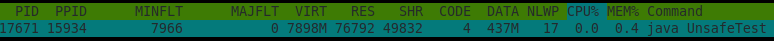
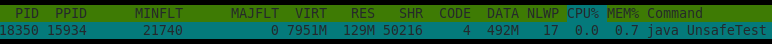
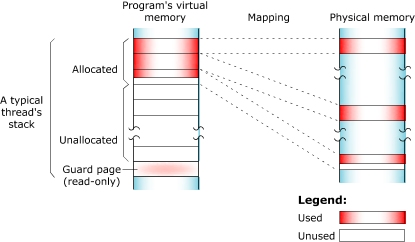
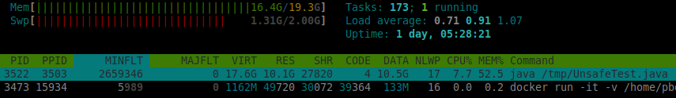
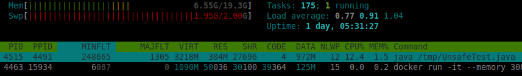

# Native Memory Tracking in detail

From time to time, we run into a memory problem that is not related to Java Heap but Native Memory.
Let's imagine the situation where we have a running container that is restarted once per day.
We look at Prometheus/Grafana to check the reason behind this issue. However, we don't spot
any problem with Java Heap size (exported via JMX) and start blaming our container scheduler
to do any inconvenient operations with our containers :). The real problem can be hidden
a bit deeper — in Native Memory.

Do you use any native memory allocator in your code or do you use any library that stores
its internal state outside the Java Heap? It could be whatever third-party code that tries
to minimize GC, such as I/O libraries or databases/caches keeping data in memory inside your process.

In this article, I will go through some basics: how the native-memory is allocated in those
libraries and mainly how to notice that something in your code started allocating native
memory that could lead to killing your container.

## How to Allocate the Native Memory

For a long time, the only efficient way to allocate memory from Java was using `sun.misc.Unsafe`.
From the very beginning, Java architects warn that this library is only for internal use-cases,
and there is no intention to keep it backward compatible as an official API. However, developers
wanted the best for their libraries and kept using Unsafe in their code. The big bang came with
Java 9 and an introduction to the Java Module System. Unsafe was automatically put inside the
`jdk.unsupported` module, and it was announced that the module will become visible for external
code depending on it for some time. But, the intention is to provide an official API, and
the libraries will be forced to migrate to it.

Another way to allocate native memory is by [ByteBuffer](https://docs.oracle.com/en/java/javase/13/docs/api/java.base/java/nio/ByteBuffer.html).
There are two implementations: `HeapByteBuffer` and `DirectByteBuffer`. While HeapByteBuffer keeps
data inside a byte array allocated on the heap, DirectByteBuffer is backed by native memory and is
primarily used for transferring data between JVM and Kernel. However, some libraries doing I/O implemented their own
libraries for dealing with the native memory, such as Netty ([ByteBuf](https://netty.io/4.1/api/io/netty/buffer/ByteBuf.html) —
[maven](https://mvnrepository.com/artifact/io.netty/netty-buffer)) or Aeron (subproject [Agrona](https://github.com/real-logic/agrona)),
especially because of two reasons: a custom collecting of unused memory (Netty uses an implementation
of manual reference-counting collector) and a more convenient API.

You can imagine, there was no reason for the library's owners to migrate from Unsafe.
Therefore, [Project Panama](https://openjdk.org/projects/panama/), dealing with an Interconnection of JVM and Native Code, came with something
new and shiny. The first output of this project was [JEP 370: Foreign Memory Access API](https://openjdk.org/jeps/370), which provided
an alternative way to access native memory that was supported by a JIT Compiler to optimize it as much
as possible to be close to the efficiency of Unsafe. As an addition, it also brought a new API for
designing a native memory layout to avoid "counting" addresses and offsets manually and provide
an explicit way of deallocating the memory in the source code (e.g. using try-with-resources).
It's available as an incubator in Java 14. Feel free to try it out and give feedback!

## Go Straight to the Example

After a short introduction, let's use the simplest way to allocate the native memory, and let's monitor what it actually does.

```java
import sun.misc.Unsafe;
import java.lang.reflect.Field;

public class UnsafeTest {
    
 public static void main(String[] args) throws Exception {

     /*
      * STAGE 1
      * Gets an access to an instance of Unsafe
      */

     Field f = Unsafe.class.getDeclaredField("theUnsafe");
     f.setAccessible(true);
     Unsafe unsafe = (Unsafe) f.get(null);
     
     System.out.println("PAGE SIZE: " + unsafe.pageSize());
     System.in.read();
     /*
      * STAGE 2
      * Allocates 50MB of native memory
      */
     int memoryBlock = 50 * 1024 * 1024;
     long address = unsafe.allocateMemory(memoryBlock);
     
     System.out.println("ALLOCATED");
     System.in.read();
     /*
      * STAGE 3
      * Touches the allocated pages:
      * writes one byte to every page to ensure that
      * the page will be physically backed/mapped in memory
      */

     long currentAddress = address;
     while (currentAddress < (address + memoryBlock)) {
         unsafe.putByte(currentAddress, (byte) 0);
         currentAddress += unsafe.pageSize();
     }

     System.out.println("MEMORY TOUCHED");
     System.in.read();
     /*
      * STAGE 4
      * Frees the allocated memory.
      */
     unsafe.freeMemory(address);

     System.out.println("DE-ALLOCATED");
     System.in.read();
 }
}
```

Let's discuss one stage after another to see what's going on there.

### Stage 1: Accessing Unsafe

First, this is just a hack to access `Unsafe` without throwing a `SecurityException` when you
try to access it via `Unsafe.getUnsafe()`. Second, we printed Page Size. The Page is
a fixed-length addressable block of virtual memory that can be mapped to physical
memory (whatever it is, RAM or swapped out memory to disk).

### Stage 2: Memory Allocation

By calling  `Unsafe.allocateMemory`, we allocate a 50MB block of memory and receive
a long value representing the address in the virtual memory. Let's compile the code and try it out.

```shell
$ javac UnsafeTest.java
< a lots of warnings because of using Unsafe :) >

$ java UnsafeTest                                            
PAGE SIZE: 4096
```

We can see that our current **PAGE_SIZE** value is 4kB. On Linux, we can check the value using:

```shell
$ getconf PAGE_SIZE
4096
```

That means that we are able to allocate memory using 4kB blocks, but if you want to adjust this
value according to your needs, feel free to look for a term, `Hugepages`, that could help you to
allocate bigger chunks of memory and reduce the overhead of *Minor Page Faults* that are thrown
if the virtual memory page is not backed by physical memory. It's up to MMU (Memory Management Unit)
to find a proper place in physical memory for our allocated block of memory. On the other hand,
in case of inappropriate usage of `Hugepages`, it could lead to significant false sharing and wasting your memory.



Use your favorite tool to examine running processes (I can recommend **htop**) and look at the **RES (Resident Set Size)**
value that reports the current size of taken physical memory by the process (anonymous pages, memory-mapped files
using mmap, shared libraries). However, it does not contain the memory that was swapped out to disk.

You can notice that in terms of the resident memory, there was no change from the previous step. Basically,
the memory allocation has no impact on physical memory, it's just virtual memory that is not backed by any physical memory.

### Stage 3: Memory Touching



What happened when we pressed "enter" again and moved to Stage 3?

We touched all allocated virtual pages from *Stage 2*. We iterated from the obtained memory address using the current
page size and put a single byte to every page. That means that every write triggered the *Minor Page Fault*,
and MMU needed to find free slots in the physical memory and mapped 4kB slot from virtual memory to the 4kB slot from physical memory.



http://www.qnx.com/developers/docs/6.5.0/index.jsp?topic=%2Fcom.qnx.doc.ide.userguide%2Ftopic%2Fmemory_AboutVirtualMem_.html

We can notice two significant changes in our memory report. RES belonging to our process finally grew up by ~50MB,
and we also increased **MINFLT** value which stands for **Minor Pages Faults**. **MAJFLT** stayed absolutely the same and equal to zero.
That means that our process didn't access any memory address that would cause **Major Page Fault**
(a memory block that is not available in the physical memory because has been already swapped out to disk and now
needs to be swapped in back to RAM to make it available for our process again)

### Stage 4: Memory De-allocation


Our circle is closed. We called `Unsafe.freeMemory` with the original memory address and releases it from the physical mapping.
We can notice that RES value went back by ~50MB.

That was a quick introduction to how Unsafe allocation and de-allocation works and what it does with our monitoring tools
(top/htop in my case). There is one more trick worth noticing: **Native Memory Tracking**.

## Help From Native Memory Tracking

Imagine that we monitor an application as a black box, and we don't know what the application actually does in detail (no source code).
The previous example helped us to determine that some kind of memory is growing inside our process, but we don't know what kind of memory.
Is it a memory leak in our Java Heap? Is it some kind of bigger native memory block for our internal cache or memory-mapped file?

While examining Java Heap memory is pretty simple, we just need to have a tool that is able to consume JMX values exported from our process,
as digging into the native memory is a bit complicated. Let's do an example of what we are able to extract from JVM. Trigger our application
with an additional flag that will start the _Native Memory Tracking_.

```shell
$ java -XX:NativeMemoryTracking=summary UnsafeTest
```

Now, execute a very simple JCMD command:

```text
$ jcmd <pid> VM.native_memory summary                                                                
Native Memory Tracking:

(Omitting categories weighting less than 1KB)

Total: reserved=6703878KB, committed=426422KB
       malloc: 22530KB #64479
       mmap:   reserved=6681348KB, committed=403892KB

-                 Java Heap (reserved=5062656KB, committed=327680KB)
                            (mmap: reserved=5062656KB, committed=327680KB) 
 
-                     Class (reserved=1048824KB, committed=1464KB)
                            (classes #2683)
                            (  instance classes #2412, array classes #271)
                            (malloc=248KB #4423) 
                            (mmap: reserved=1048576KB, committed=1216KB) 
                            (  Metadata:   )
                            (    reserved=65536KB, committed=8640KB)
                            (    used=8510KB)
                            (    waste=130KB =1,50%)
                            (  Class space:)
                            (    reserved=1048576KB, committed=1216KB)
                            (    used=1092KB)
                            (    waste=124KB =10,19%)
 
-                    Thread (reserved=19556KB, committed=968KB)
                            (thread #19)
                            (stack: reserved=19504KB, committed=916KB)
                            (malloc=31KB #118) 
                            (arena=20KB #36)
 
-                      Code (reserved=247963KB, committed=7823KB)
                            (malloc=275KB #2077) 
                            (mmap: reserved=247688KB, committed=7548KB) 
 
-                        GC (reserved=238187KB, committed=62475KB)
                            (malloc=17227KB #1190) 
                            (mmap: reserved=220960KB, committed=45248KB) 
 
-                 GCCardSet (reserved=18KB, committed=18KB)
                            (malloc=18KB #243) 
 
-                  Compiler (reserved=188KB, committed=188KB)
                            (malloc=23KB #120) 
                            (arena=165KB #5)
 
-                  Internal (reserved=219KB, committed=219KB)
                            (malloc=183KB #2563) 
                            (mmap: reserved=36KB, committed=36KB) 
 
-                     Other (reserved=10KB, committed=10KB)
                            (malloc=10KB #2) 
 
-                    Symbol (reserved=2861KB, committed=2861KB)
                            (malloc=2501KB #51738) 
                            (arena=360KB #1)
 
-    Native Memory Tracking (reserved=1013KB, committed=1013KB)
                            (malloc=5KB #77) 
                            (tracking overhead=1008KB)
 
-        Shared class space (reserved=16384KB, committed=12600KB)
                            (mmap: reserved=16384KB, committed=12600KB) 
 
-               Arena Chunk (reserved=195KB, committed=195KB)
                            (malloc=195KB) 
 
-                    Module (reserved=157KB, committed=157KB)
                            (malloc=157KB #1221) 
 
-                 Safepoint (reserved=8KB, committed=8KB)
                            (mmap: reserved=8KB, committed=8KB) 
 
-           Synchronization (reserved=48KB, committed=48KB)
                            (malloc=48KB #601) 
 
-            Serviceability (reserved=17KB, committed=17KB)
                            (malloc=17KB #9) 
 
-                 Metaspace (reserved=65575KB, committed=8679KB)
                            (malloc=39KB #15) 
                            (mmap: reserved=65536KB, committed=8640KB) 
 
-      String Deduplication (reserved=1KB, committed=1KB)
                            (malloc=1KB #8)
```

We obtained all the information about current native memory allocation from all JVM areas.
It's out of the scope of this article to go through all of this. But if you want to know more, I can recommend
[this article](https://systemadminspro.com/java-in-docker-disks-native-memory-tracking/).

Let's make a baseline in **Stage 1**:

```shell
$ jcmd <pid> VM.native_memory baseline
```

Then hit "enter", move to **Stage 2** (Memory allocation), and create a diff between those two stages:

```shell
$ jcmd <pid> VM.native_memory summary.diff
Total: reserved=6755091KB +51201KB, committed=477635KB +51201KB
...
-                     Other (reserved=51210KB +51200KB, committed=51210KB +51200KB)
                            (malloc=51210KB +51200KB #3 +1)
```

We can see the section **Other** containing allocated native memory by Unsafe and additional info:

- The current value of allocated bytes,
- A change between the current value and the baseline
- #1 number of allocations.

## What Should We Expect From a Container

We're now at our last example, and it regards a **Docker container**. How does the native memory behaves inside our container?
What is the impact if we try to allocate more than we configured during the container startup?

Let's modify our code a bit and make an aggressive killer from it. The application starts allocating 50MB every
500millis and automatically touches all the allocated pages to reflect that in RSS memory.

```java
public static void main(String[] args) throws Exception {
    Field f = Unsafe.class.getDeclaredField("theUnsafe");
    f.setAccessible(true);
    Unsafe unsafe = (Unsafe) f.get(null);
    
    int i = 1;
    while (true) {
        int memoryBlock = 50 * 1024 * 1024;
        long address = unsafe.allocateMemory(memoryBlock);
            
        long currentAddress = address;
        while (currentAddress < (address + memoryBlock)) {
            unsafe.putByte(currentAddress, (byte) 0);
            currentAddress += unsafe.pageSize();
        }
        System.out.println("ALLOCATED AND TOUCHED: " + i++);
        Thread.sleep(500);
    }
}
```

Execute the code inside the container using this simple command.

```shell
$ docker run -it -v ${PWD}:/tmp eclipse-temurin:19 java /tmp/UnsafeTest.java
```

You can notice that we didn't limit the container with any parameters, and it results in
the uncontrolled growth of the host's memory and swapping out the physical memory to a disk
to withstand the allocation rate.



What if we limit the size of our container? What's going to be its behavior afterward?

```shell
docker run -it --memory 300m -v ${PWD}:/tmp eclipse-temurin:19 java /tmp/UnsafeTest.java
```

We limited our container to 300MB and ran the same test again.



We can see that the memory is kept on 300MB RSS. However, according to a log statement, _"ALLOCATED AND TOUCHED: 19"_,
we did 19 iterations, which equates to ~950MB of allocated and touched memory. In the snippet, it's very clear that
the OS hides all memory above 300MB in the swap memory.

Let's disable swapping and see how quickly we fail with our memory allocation program.

```shell
$ docker run -it --memory 300m --memory-swappiness 0 -v ${PWD}:/tmp eclipse-temurin:19 java /tmp/UnsafeTest.java
```

This is what we expected. We did 5 iterations, reached 300MB, and failed. Be aware of this behavior on production and
design your Java process (native + heap memory) to respect this aspect. Always check the configuration passed to your
container. Disabling swapping leads to a better separation of processes. The application behavior is more transparent,
and we need to work with clearly defined space.

> Your container scheduler (Kubernetes, Mesos, Nomad, ..) has very likely disabled swapping.

You can also check the **Docker stats** tool that monitors currently running containers on a host. You can also notice some
differences between the **Resident Set Size** and memory reported by **docker stats**. The reason is that RSS contains all physical
memory regarding this process, even shared libraries that could be counted multiple times (for multiple processes).
Docker stats tool has exactly this description (according to official configuration):

"On Linux, the Docker CLI reports memory usage by subtracting page cache usage from the total memory usage.
The API does not perform such a calculation but rather provides the total memory usage and the amount from the page cache
so that clients can use the data as needed."