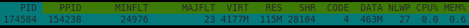
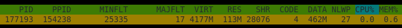

# Tracking RSS down in a JVM Process

Very quick intro into how RSS in Linux OS works along with JVM. There are multiple places to read
information about the consumed memory by the process and a developer needs to exactly know
what these numbers mean to be able to predict the behavior in some constrained environments,
e.g. Containers. It's a mandatory introduction to following articles dealing with _JVM and Containers_.

This article is might be more about Linux than JVM, but it's actually the fun, right? 
The Linux <-> JVM interoperability :) .. The main reason behind this article is to be able to count   
the memory consumed by the process, at least approximately (sometimes it's very hard to track it down to the last byte).
In many cases I won't take swapping/paging in the account because it's a perfect idea to switch it off when running your app inside containers.
That would bring another level of complexity to this topic.

Let's get started briefly with Linux basics which are needed to get further to JVM!

### Virtual/Physical Memory and Resident Set Size

Virtual Memory is a concept in Linux OS (and many others) to represent an abstraction of physical memory on your machine.
Code running in _Userspace_ (simple our apps) cannot allocate directly to the physical memory, it always needs to go through
virtual memory and let OS map chunks of physical memory to virtual memory (or vice verse if you want :). 
The mapper between virtual and physical is called `Memory Management Unit (MMU)` and translates physical memory addresses into virtual ones.
If we look at the info of the process, we can see that OS assigned huge virtual memory to the process. The reason is that the virtual
memory consists of available RAM and disk used as an extension to support more processes using paging
(putting inactive pages of the running processes to the disk).

Let's move to the next term `RSS (Resident Set Size)`. Linux OS maps pages between virtual and physical memory on demand (or lazily) that 
means that you can `mmap` (a tool gives to the process a chunk of memory from the virtual memory) some portion of memory. The chunk of memory
is `reserved` but it's still not reflected to RSS -> it's still not mapped by MMU between virtual and physical memory. We need to `touch` 
the memory to push the OS to map the addresses. 

The example allocated the memory chunk, but it still no visible in RRS until we `touch` the pages. Therefore, we write a single value 
at the beginning of every page, and then we can spot that RSS grows -> MMU maps physical memory. More detail in our previous 
[article](?native-memory-tracking).

```java 
import sun.misc.Unsafe;
import java.lang.reflect.Field;

public class UnsafeTest {
    
 public static void main(String[] args) throws Exception {

     /*
      * STAGE 1
      * Gets an access to an instance of Unsafe
      */

     Field f = Unsafe.class.getDeclaredField("theUnsafe");
     f.setAccessible(true);
     Unsafe unsafe = (Unsafe) f.get(null);
     
     System.out.println("PAGE SIZE: " + unsafe.pageSize());
     System.in.read();
     /*
      * STAGE 2
      * Allocates 50MB of native memory
      */
     int memoryBlock = 50 * 1024 * 1024;
     long address = unsafe.allocateMemory(memoryBlock);
     
     System.out.println("ALLOCATED");
     System.in.read();
     /*
      * STAGE 3
      * Touches the allocated pages:
      * writes one byte to every page to ensure that
      * the page will be physically backed/mapped in memory
      */

     long currentAddress = address;
     while (currentAddress < (address + memoryBlock)) {
         unsafe.putByte(currentAddress, (byte) 0);
         currentAddress += unsafe.pageSize();
     }

     System.out.println("MEMORY TOUCHED");
     System.in.read();
     /*
      * STAGE 4
      * Frees the allocated memory.
      */
     unsafe.freeMemory(address);

     System.out.println("DE-ALLOCATED");
     System.in.read();
 }
}
```

This is an output from HTOP tools, and it says that the process has:
- **Virtual memory**: 4177MB
- **Resident Set Size (RSS)**: 115MB



Absolutely great article!

https://scoutapm.com/blog/understanding-page-faults-and-memory-swap-in-outs-when-should-you-worry


### Pages

We have mentioned a term `page` multiple times. The operating system does not want to work on byte-basis, it would be very inefficient, 
therefore, the smallest unit of data was introduced. Virtual memory is divided into pages which is a fixed-length 
contiguous block of virtual memory. Every page has a single entry in the `page table`.

Current pages size in bytes:

```shell
$ getconf PAGESIZE
4096
```

## Let's move to JVM!

Let's use a piece of Java code mentioned above a go through all the stage and show differences between `JVM / OS / MMU`.

#### 1. Step

- No special allocation, just the application after the startup



```text
Native Memory Tracking:

(Omitting categories weighting less than 1KB)

Total: reserved=6697858KB, committed=414638KB
       malloc: 19578KB #14009
       mmap:   reserved=6678280KB, committed=395060KB

-                     Other (reserved=10KB, committed=10KB)
                            (malloc=10KB #2) 
```


